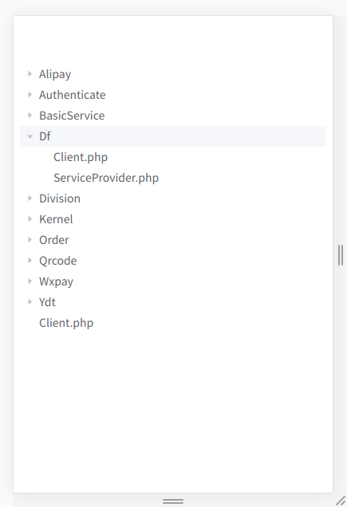

# element-tree

该composer 包是用来方便element-ui读取文件目录的

最近公司做项目，需要读取目录下的文件和文件夹，感觉element的tree组件挺漂亮的，就采用了这个做前端输出，但是在后端构造数据结构的时候遇到了一些波折，不过最终还是解决了，为了方便他人，我把后端的实现方式开源了，希望能帮助到别人

## Install

```
composer require tu6ge/element-tree
```

## Use

php代码：
```php
include_once "vendor/autoload.php";

$tree = new \ElementTree\Tree();
$rs = $tree->get(__DIR__);

$json = json_encode($rs);

```
vue 代码：
```vue
<template>
   <el-tree :data="list" :props="defaultProps" @node-click="handleNodeClick"></el-tree>
</template>
<script>
import {Tree} from "element-ui"
export default {
  name: 'HelloWorld',
  data () {
    return {
        msg: 'Welcome to Your Vue.js App',
        list: 'php response json data'
        defaultProps: {
          children: 'children',
          label: 'label'
        }
    }
  },
  methods:{
      handleNodeClick(data) {
        console.log(data);
      }
  },
  components:{
      [Tree.name]:Tree
  }
}
</script>

```

## 最终的效果



